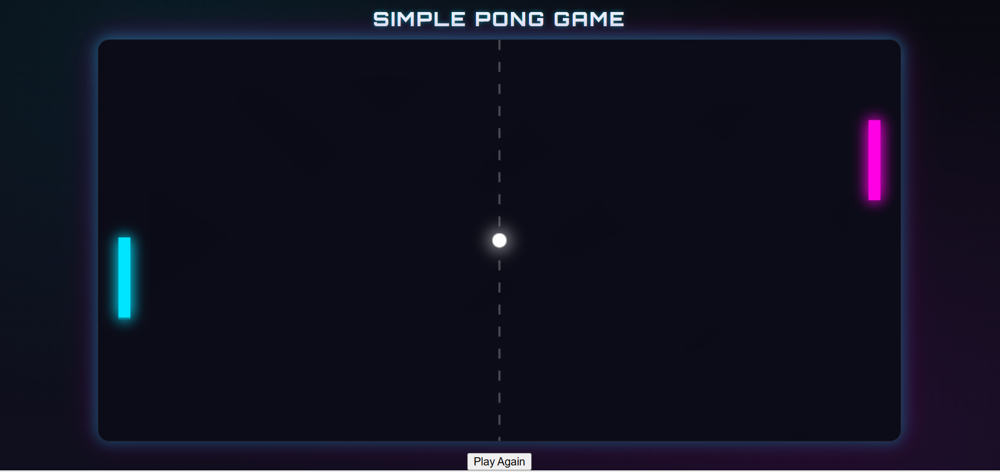
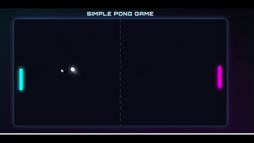

# Neon Pong Game 🏓✨

A sleek, modern **Pong** game built with vanilla **HTML5 Canvas, CSS, and JavaScript**. Features stunning neon-style graphics with glowing effects, smooth 60fps gameplay, and an intelligent AI opponent.

## 🎮 Live Demo

```
https://YOUR_USERNAME.github.io/pong-game/
```

## 📸 Screenshots & Gameplay


*Experience retro gaming with a modern neon twist*


*Watch the smooth neon gameplay in action*

## ✨ Features

- 🌟 **Stunning neon graphics** with glowing paddles and ball
- 🎯 **Smooth 60 FPS gameplay** using requestAnimationFrame
- 🤖 **Smart AI opponent** with realistic tracking behavior  
- ⚡ **Dynamic ball physics** with spin based on paddle hit position
- 🏆 **Score system** - first to 5 points wins
- 🖱️ **Intuitive mouse controls** for fluid paddle movement
- 🌈 **Motion trail effects** for enhanced visual appeal
- 📱 **Responsive canvas** that adapts to different screen sizes

## 🎮 Controls

- **Mouse Movement** → Control your paddle (left side)
- **Click "Play Again"** → Restart after game over

## 🚀 Quick Start

1. **Clone or download** this repository
2. **Open `index.html`** in any modern web browser
3. **Start playing!** No installation or build process required

### Development Server (Optional)
For live reload during development:
```bash
# Using Python
python -m http.server 8000

# Using Node.js
npx serve .

# Using VS Code Live Server extension
# Right-click index.html → "Open with Live Server"
```

## 📁 Project Structure

```
pong-game/
├── 📄 index.html      # Main HTML file with canvas
├── 🎨 style.css       # Styling and responsive design
├── ⚡ script.js       # Game logic and rendering
├── 📖 README.md       # This file
├── 🔒 .gitignore      # Git ignore rules
└── 📜 LICENSE         # MIT license
```

## 🛠️ Technical Details

### Game Architecture
- **Game Loop:** `update()` → `draw()` → `requestAnimationFrame()`
- **Collision Detection:** AABB (Axis-Aligned Bounding Box) collision
- **AI Behavior:** Target tracking with speed limits and dead zones
- **Rendering:** Canvas 2D API with shadow effects for neon glow

### Visual Effects
- **Neon Glow:** Canvas `shadowColor` and `shadowBlur` properties
- **Motion Trails:** Semi-transparent overlay instead of full screen clear
- **Dynamic Colors:** Cyan player paddle, magenta AI paddle, white ball

## 🚀 Deployment

### GitHub Pages
1. Create a new repository on GitHub
2. Upload your files:
   ```bash
   git init
   git add .
   git commit -m "Add Neon Pong game"
   git branch -M main
   git remote add origin https://github.com/USERNAME/pong-game.git
   git push -u origin main
   ```
3. Enable GitHub Pages:
   - Go to **Settings** → **Pages**
   - Source: **Deploy from branch**
   - Branch: **main** / **(root)**
4. Access your game at: `https://USERNAME.github.io/pong-game/`

## 🎨 Customization

### Colors
Edit the neon colors in `script.js`:
```javascript
// Player paddle (left)
ctx.shadowColor = "#00e5ff"; // Cyan

// AI paddle (right)  
ctx.shadowColor = "#ff00e5"; // Magenta

// Ball
ctx.shadowColor = "#ffffff"; // White
```

### Game Settings
Adjust gameplay in `script.js`:
```javascript
const paddleWidth = 12;     // Paddle width
const paddleHeight = 80;    // Paddle height
const ballSize = 14;        // Ball diameter
const aiSpeed = 4;          // AI difficulty
const WIN_SCORE = 5;        // Points to win
```

## 🤝 Contributing

1. Fork the repository
2. Create a feature branch: `git checkout -b feature-name`
3. Commit changes: `git commit -m "Add feature"`
4. Push to branch: `git push origin feature-name`
5. Open a Pull Request

## 📝 License

MIT License - feel free to use this project for learning, modification, or commercial purposes.

## 🙏 Credits

- Built with vanilla JavaScript for maximum compatibility
- Inspired by the classic Atari Pong (1972)
- Neon aesthetic inspired by synthwave and retro-futurism

---

⭐ **Star this repo** if you enjoyed the game!